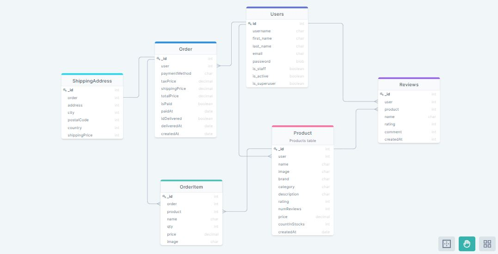

# Rest API With Django

## Description

This is an Ecommerce website build with Reactjs and Redux as frontend and Django Restful API as Backend.

The Features of this Website are:

- Full featured shopping cart

- Product reviews and ratings

- Top products carousel

- Product pagination

- Product search feature

- User profile with orders

- Admin product management

- Admin user management

- Admin Order details page

- Mark orders as delivered option

- Checkout process (shipping, payment method, etc)

- PayPal / credit card integration

#### Concepts Learned:

1. React with Functional Components & Hooks

2. React router

3. React-Bootstrap UI library

4. How to structure components

5. Component level state & props

6. Managing global state with Redux (Actions & Reducers)

7. Using Redux state in components (useDispatch & useSelector)

8. Creating an extensive back end with Express

9. JWT authentication (JSON web tokens)

10. Custom error handler

11. Integrating the PayPal API

**Django** is a high-level Python web framework that encourages rapid development and clean, pragmatic design. Built by experienced developers, it takes care of much of the hassle of web development, so you can focus on writing your app without needing to reinvent the wheel. It’s free and open source.
   
**MySQL** is free and open-source software under the terms of the GNU General Public License, and is also available under a variety of proprietary licenses. MySQL has stand-alone clients that allow users to interact directly with a MySQL database using SQL, but more often, MySQL is used with other programs to implement applications that need relational database capability.

---

## Pre-requisites
Nodejs installed with npm (yarn is recommended).
- [Installation guide](https://docs.npmjs.com/downloading-and-installing-node-js-and-npm)

At least Python 3.6 installed. 
- [Installation guide on Windows](https://docs.python.org/3.6/using/windows.html)
- [Installation guide on Unix](https://docs.python.org/3.6/using/unix.html)
- [Installation guide on Macintosh](https://docs.python.org/3.6/using/mac.html)

---

## Getting Started

1. Clone the repository using:
    > git clone https://github.com/rroy11705/Django_react_ecom.git

2. Go to client folder and run:
    > npm install
    or 
    > yarn install

3. Then go to the server folder. It is suggested to use a virtual environment.
- To install virtualenv
    > pip install virtualenv
- To create a virtualenv
    > virtualenv env_name
- To activate virtualenv
    > source env_name/bin/activate (on linux or mac)
    > env_name\Scripts\activate (on windows)

4. Go to console, open cmd with server folder path and install dependencies from _requirements.txt_ file using:
    > pip install -r requirements.txt

5. Make Sure you have MySQL installed and running. 
   You can download MySQL from [MySQL Community Downloads](https://dev.mysql.com/downloads/). For this project we only need MySQL Server and MySQL Workbench.

6. Rename the _.envexample_ file to _.env_ and assign significant values to the environment variables

7. From console run the _run-app.py_ using:
    > python app.py

8. Use Postman to check the endpoints.

9. Go to Client folder and run the following to start the client server (react project):
    > npm start
    or 
    > yarn start

---

## Database Architecture 

---

## Endpoints

The Endpoints documentation is published in [postman](https://documenter.getpostman.com/view/7163762/UUy66k4d) and can be accessed publicly.

---

## LICENSE

[MIT License](https://github.com/rroy11705/Django_react_ecom/blob/main/LICENSE)
Copyright (c) 2021 Rahul Roy